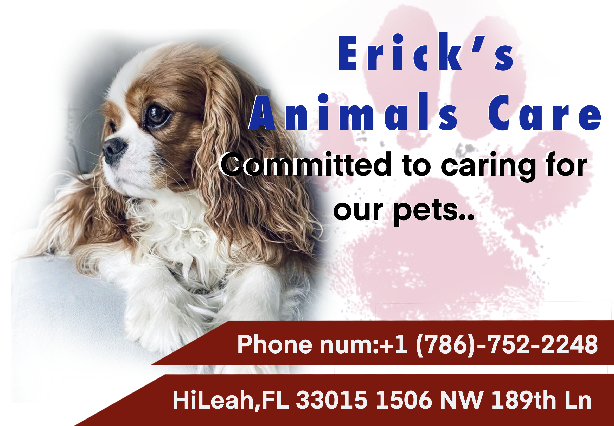

#
<!DOCTYPE html>
<head>
    <meta name ="viewport" content="width=devicewidth" charset="UTF-8"> 
    <link rel="stylesheet" href="Erickspetcare.css">
</head>
<body>
    
<h2>Erick`s Animal Care</h2>

   
  <!--logo-->

   
 <!--banner-->

 

   

  <h4>
  Medical Prescription: Required
  </h4>

  <h4>
    If your Dog cant Run and do exercise let me know: Required
  </h4>

  

  <h4>
 info about your Pet food Recomended: Required
  </h4>

<h4>
is your Dog cables and plastic eater?: Tell us!
</h4>

<h4>
if your are spanish Speaker: Tell me!
</h4>

<h4>
  it `s a big Dog!  66-71 cm : $35 per day !
  </h4>
  

  <h4>
    it `s a litle Dog  16-20 cm : $25 per day !
    </h4>

          
        

</body>
